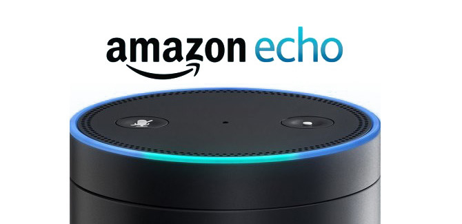

# Amazon Alexa

> Ce projet entre dans le cadre de la publication de l'article 'Amazon Alexa, vue de près !' sur le magasine [Programez](www.programmez.com), il contient le code source des examples illustrés dans l'article ainsi que la fonction AWS Lambda pour faire le portage sur le cloud.

- Date de la publication : TODO
- Numéro de la série : TODO
- Numéro de la page : TODO

Tous les exemple sont testés par le biais de l'assistant vocal intelligent 'Amazon Echo'.

## The Intent Schema
```
{
  "intents": [
    {
      "intent": "GetHoroscope",
      "slots": [
        {
          "name": "Sign",
          "type": "LIST_OF_SIGNS"
        },
        {
          "name": "Date",
          "type": "AMAZON.DATE"
        }
      ]
    },
    {
      "intent": "GetLuckyNumbers"
    }
  ]
}
```
<p align="center">
	
</p>